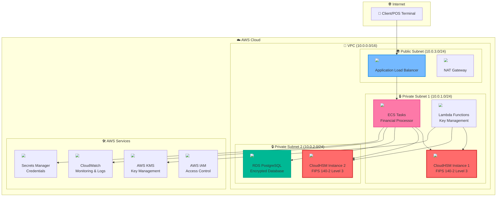
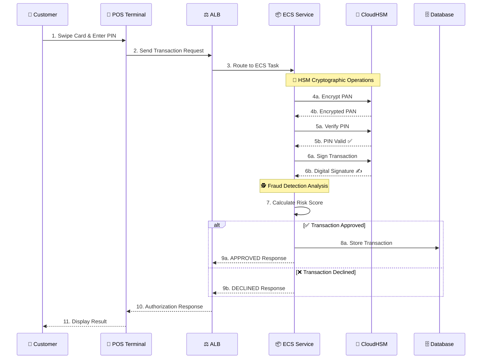
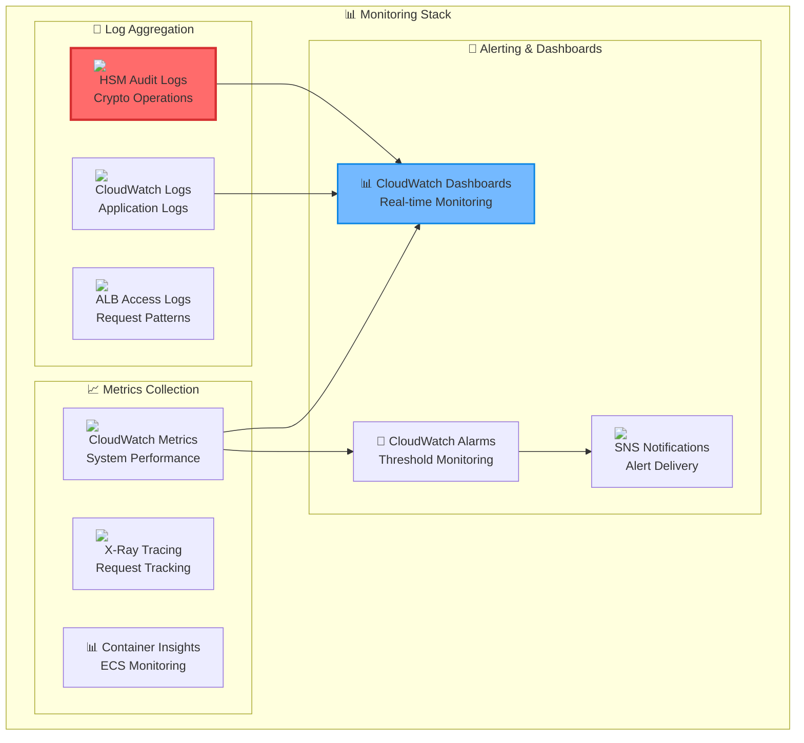
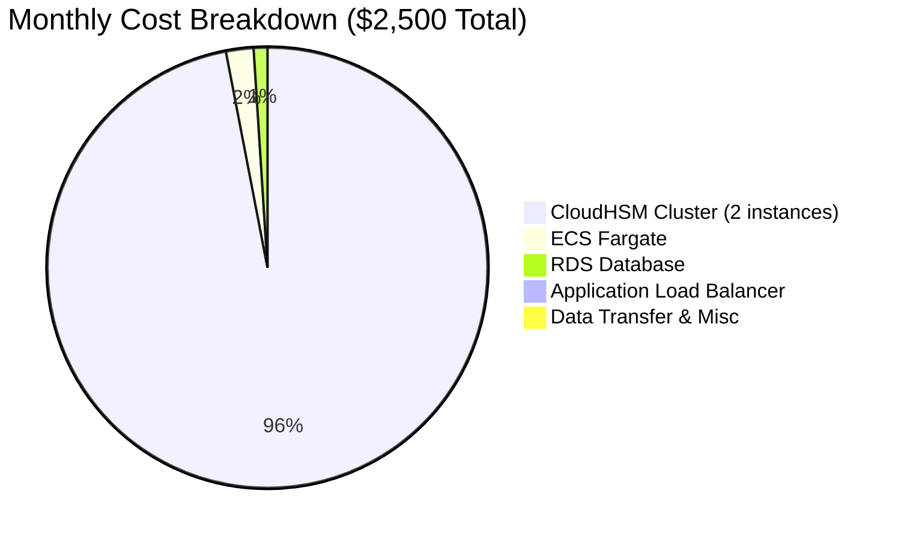

# CloudHSM Financial Transaction Processing Demo

[](https://aws.amazon.com/cloudhsm/)
[](LICENSE)
[](https://aws.amazon.com/cloudformation/)
[](https://csrc.nist.gov/publications/detail/fips/140/2/final)

A comprehensive demonstration of secure financial transaction processing using AWS CloudHSM, showcasing enterprise-grade cryptographic operations, PCI DSS compliance, and real-time fraud detection.

## 🏗️ Architecture Overview




> 📊 **[View Detailed Architecture Diagrams](docs/diagrams.md)** - Interactive diagrams with transaction flows, security layers, and compliance frameworks

## 💳 Transaction Processing Flow



## 🎯 Key Features

### 🔐 Security Features
-  **Hardware-based cryptographic operations**
-  **Secure PIN validation without exposure**
-  **Card data encryption using HSM-protected keys**
-  **Non-repudiation for all transactions**
-  **Immutable logging of all cryptographic operations**

### 💳 Financial Processing
-  **Real-time authorization processing**
-  **Cryptographic validation and risk scoring**
-  **Complete cardholder data protection**
-  **PIN + cryptogram validation**
-  **Automated rotation and secure backup**

### 🏢 Enterprise Features
-  **Multi-AZ deployment with automatic failover**
-  **ECS services and HSM cluster expansion**
-  **Comprehensive dashboards and alerting**
-  **Automated audit and compliance reports**

## 📋 Prerequisites

- AWS CLI configured with appropriate permissions
- Docker installed (for local testing)
- OpenSSL for certificate operations
- Basic understanding of PKI and cryptographic operations

### Required AWS Permissions
```json
{
    "Version": "2012-10-17",
    "Statement": [
        {
            "Effect": "Allow",
            "Action": [
                "cloudhsm:*",
                "cloudformation:*",
                "ecs:*",
                "ec2:*",
                "iam:*",
                "rds:*",
                "elasticloadbalancing:*",
                "logs:*",
                "secretsmanager:*"
            ],
            "Resource": "*"
        }
    ]
}
```

## 🚀 Quick Start

### 1. Clone the Repository
```bash
git clone https://github.com/YOUR_USERNAME/cloudhsm-financial-transaction-demo.git
cd cloudhsm-financial-transaction-demo
```

### 2. Deploy Infrastructure
```bash
# Make scripts executable
chmod +x scripts/*.sh

# Deploy the complete infrastructure
./scripts/deploy-and-test.sh
```

### 3. Initialize CloudHSM
```bash
# Initialize the HSM cluster
./scripts/initialize-hsm.sh
```

### 4. Test the System
```bash
# Run comprehensive tests
./scripts/run-tests.sh
```

## 📁 Project Structure

```
cloudhsm-financial-transaction-demo/
├── README.md
├── LICENSE
├── .gitignore
├── infrastructure/
│   ├── cloudhsm-financial-demo.yaml      # Main infrastructure stack
│   ├── financial-app-stack.yaml          # Application deployment stack
│   └── monitoring-dashboard.json         # CloudWatch dashboard
├── scripts/
│   ├── deploy-and-test.sh                # Complete deployment script
│   ├── initialize-hsm.sh                 # HSM initialization
│   ├── run-tests.sh                      # Test suite
│   └── cleanup.sh                        # Resource cleanup
├── src/
│   ├── financial-processor/              # Main application code
│   ├── hsm-client/                       # CloudHSM client utilities
│   └── fraud-detection/                  # Fraud detection algorithms
├── tests/
│   ├── unit/                             # Unit tests
│   ├── integration/                      # Integration tests
│   └── load/                             # Load testing scripts
├── docs/
│   ├── architecture.md                   # Detailed architecture
│   ├── security.md                       # Security implementation
│   ├── compliance.md                     # Compliance guide
│   └── troubleshooting.md                # Common issues and solutions
└── examples/
    ├── transaction-samples.json          # Sample transactions
    └── api-examples.md                   # API usage examples
```

## 🔧 Configuration

### Environment Variables
```bash
export CLOUDHSM_CLUSTER_ID="cluster-xxxxxxxxx"
export AWS_REGION="us-east-1"
export DATABASE_ENDPOINT="your-db-endpoint"
export FRAUD_THRESHOLD="75"
```

### CloudHSM Client Configuration
```json
{
  "cluster_id": "cluster-xxxxxxxxx",
  "region": "us-east-1",
  "server_client_cert_file": "/opt/cloudhsm/etc/server-client.crt",
  "server_client_key_file": "/opt/cloudhsm/etc/server-client.key",
  "trust_store": "/opt/cloudhsm/etc/trust-store"
}
```

## 🧪 Testing

### Unit Tests
```bash
cd tests/unit
python -m pytest test_financial_processor.py -v
```

### Integration Tests
```bash
cd tests/integration
python -m pytest test_hsm_operations.py -v
```

### Load Testing
```bash
cd tests/load
./load_test.sh 1000 # 1000 concurrent transactions
```

## 📊 Monitoring and Observability




### Key Metrics
- **Transaction Throughput**: Transactions per second
- **HSM Latency**: Cryptographic operation response time
- **Error Rates**: Failed transactions and HSM operations
- **Fraud Detection**: Blocked transactions and false positives

### CloudWatch Dashboards
- **Application Performance**: ECS metrics, ALB performance
- **HSM Operations**: Cluster health, operation latency
- **Security Events**: Failed authentications, fraud attempts
- **Compliance**: Audit trail completeness, key rotation status

### Alerts
- HSM cluster health degradation
- High transaction error rates
- Unusual fraud detection patterns
- Key rotation failures

## 🔒 Security Considerations

### Data Protection
- All sensitive data encrypted at rest and in transit
- HSM keys never leave the hardware boundary
- PIN blocks use industry-standard formatting (ISO 9564)
- Database encryption using AWS KMS

### Network Security
- Private subnets for all sensitive components
- Security groups with least-privilege access
- VPC endpoints for AWS service communication
- WAF protection for public endpoints

### Compliance
-  **Cardholder data protection**
-  **Financial reporting controls**
-  **Data protection and privacy**
-  **Cryptographic module security**

## 💰 Cost Optimization




### Infrastructure Costs (Monthly Estimates)
- **CloudHSM Cluster**: ~$2,400 (2 instances)
- **ECS Fargate**: ~$50-200 (depending on load)
- **RDS**: ~$25-50 (db.t3.micro)
- **ALB**: ~$20-30
- **Data Transfer**: ~$10-50

### Cost Optimization Strategies
-  **Use Fargate Spot for non-critical workloads**
-  **Optimize RDS instances based on actual usage**
-  **Implement CloudWatch log retention policies**
-  **Use reserved instances for predictable workloads**

## 🚨 Troubleshooting

### Common Issues

#### HSM Cluster Initialization Fails
```bash
# Check cluster state
aws cloudhsmv2 describe-clusters --filters clusterIds=cluster-xxxxxxxxx

# Verify network connectivity
aws ec2 describe-security-groups --group-ids sg-xxxxxxxxx
```

#### Transaction Processing Errors
```bash
# Check ECS service logs
aws logs get-log-events --log-group-name /aws/ecs/cloudhsm-financial-demo

# Verify HSM connectivity
./scripts/test-hsm-connection.sh
```

#### High Latency Issues
```bash
# Monitor HSM performance
aws cloudwatch get-metric-statistics \
  --namespace AWS/CloudHSM \
  --metric-name OperationLatency
```

## 🤝 Contributing

1. Fork the repository
2. Create a feature branch (`git checkout -b feature/amazing-feature`)
3. Commit your changes (`git commit -m 'Add amazing feature'`)
4. Push to the branch (`git push origin feature/amazing-feature`)
5. Open a Pull Request

### Development Guidelines
- Follow AWS Well-Architected Framework principles
- Include comprehensive tests for new features
- Update documentation for any API changes
- Ensure security best practices are followed

## 📚 Additional Resources

### AWS Documentation
- [AWS CloudHSM User Guide](https://docs.aws.amazon.com/cloudhsm/)
- [CloudHSM Client SDK](https://docs.aws.amazon.com/cloudhsm/latest/userguide/client-sdk.html)
- [PCI DSS on AWS](https://aws.amazon.com/compliance/pci-dss-level-1-faqs/)

### Industry Standards
- [PCI DSS Requirements](https://www.pcisecuritystandards.org/)
- [FIPS 140-2 Standard](https://csrc.nist.gov/publications/detail/fips/140/2/final)
- [ISO 9564 PIN Management](https://www.iso.org/standard/43897.html)

### Training and Certification
- [AWS Security Specialty Certification](https://aws.amazon.com/certification/certified-security-specialty/)
- [CloudHSM Workshop](https://cloudhsm.workshop.aws/)

## 📄 License

This project is licensed under the MIT License - see the [LICENSE](LICENSE) file for details.

## ⚠️ Disclaimer

This is a demonstration project for educational purposes. While it follows security best practices, additional hardening and testing would be required for production use. Always consult with security professionals and conduct thorough testing before deploying financial applications.

## 🆘 Support

- **Issues**: [GitHub Issues](https://github.com/YOUR_USERNAME/cloudhsm-financial-transaction-demo/issues)
- **Discussions**: [GitHub Discussions](https://github.com/YOUR_USERNAME/cloudhsm-financial-transaction-demo/discussions)
- **AWS Support**: For CloudHSM-specific issues, contact AWS Support

---

**Built with ❤️ for secure financial processing on AWS**
