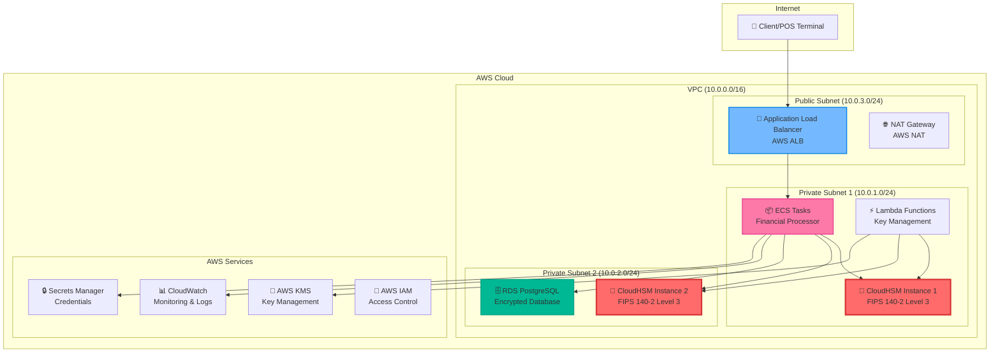
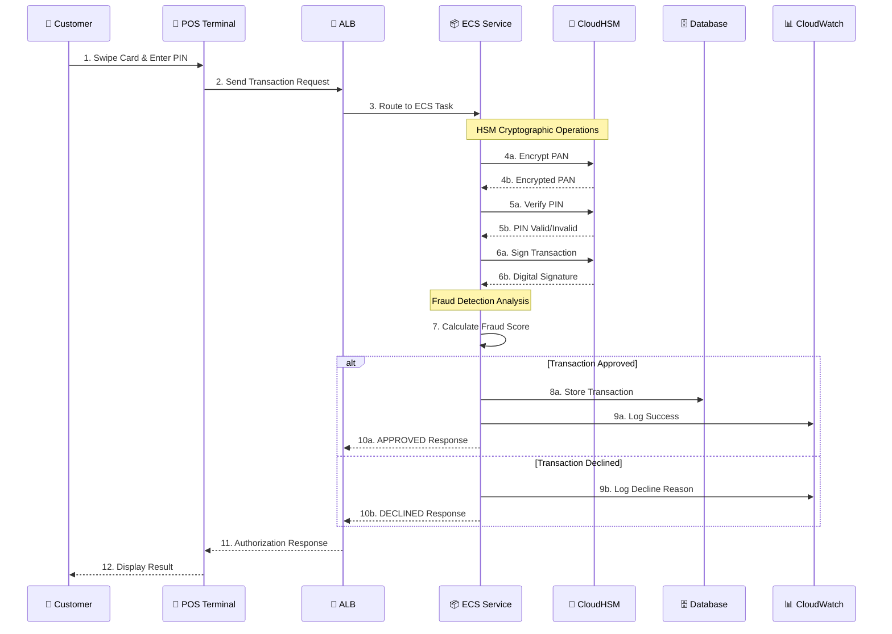
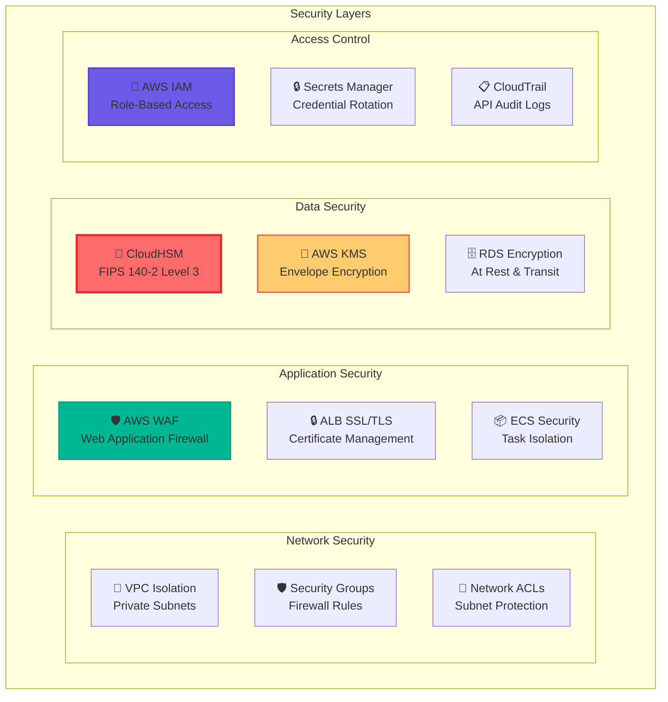
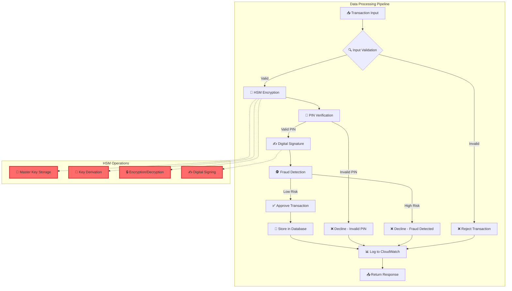
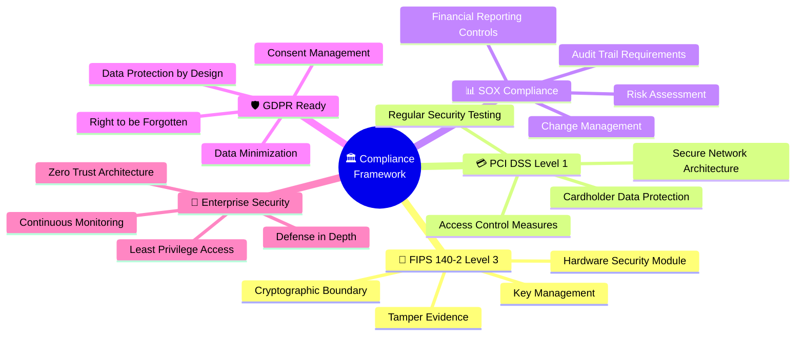
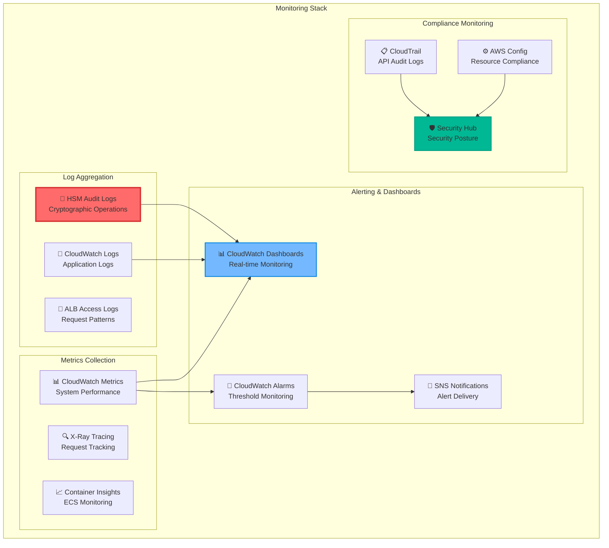
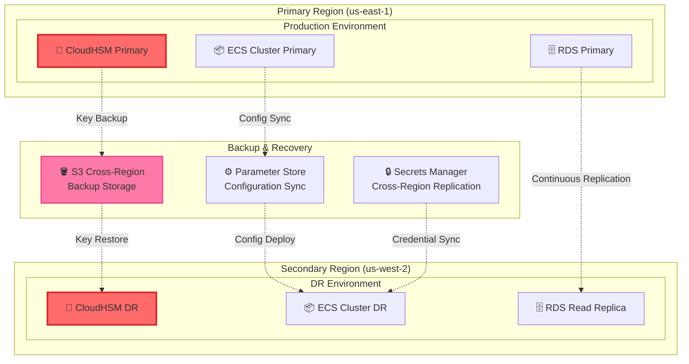
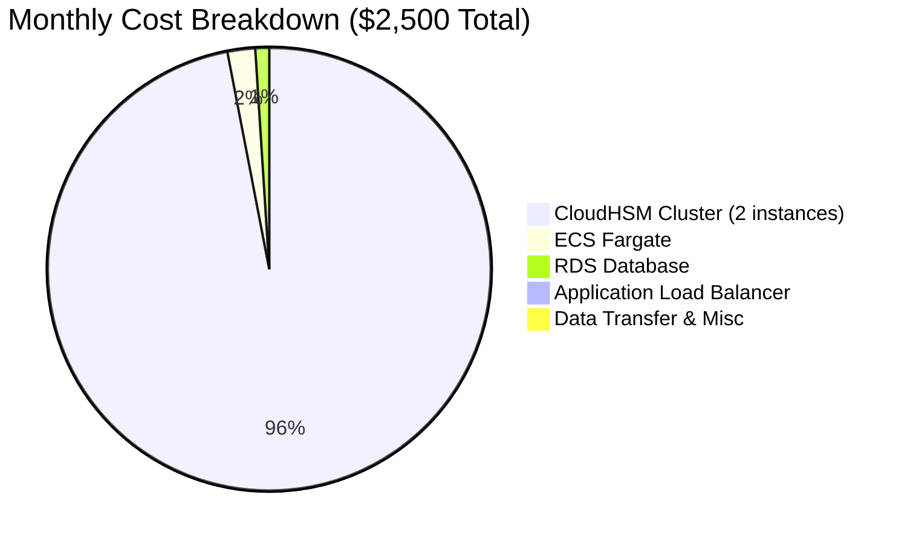
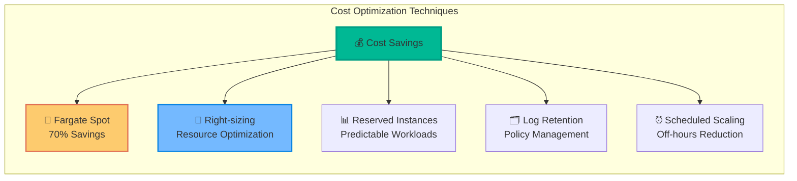

# Architecture Diagrams

This document contains detailed architecture diagrams for the CloudHSM Financial Transaction Processing Demo.

## High-Level Architecture

## Transaction Processing Flow

## Security Architecture

## Data Flow Architecture

## Compliance Framework

## Monitoring and Observability

## Disaster Recovery Architecture

## Cost Optimization Strategy

## Legend

| Symbol | AWS Service | Description |
|--------|-------------|-------------|
| 🔐 | CloudHSM | Hardware Security Module |
| 📦 | ECS | Elastic Container Service |
| 🔄 | ALB | Application Load Balancer |
| 🗄️ | RDS | Relational Database Service |
| ⚡ | Lambda | Serverless Functions |
| 📊 | CloudWatch | Monitoring & Logging |
| 🔑 | KMS | Key Management Service |
| 🔒 | Secrets Manager | Credential Management |
| 👥 | IAM | Identity & Access Management |
| 🛡️ | WAF | Web Application Firewall |
| 📋 | CloudTrail | API Audit Logging |
| 🪣 | S3 | Simple Storage Service |

---

*All diagrams follow AWS Well-Architected Framework principles and represent production-ready architecture patterns.*
