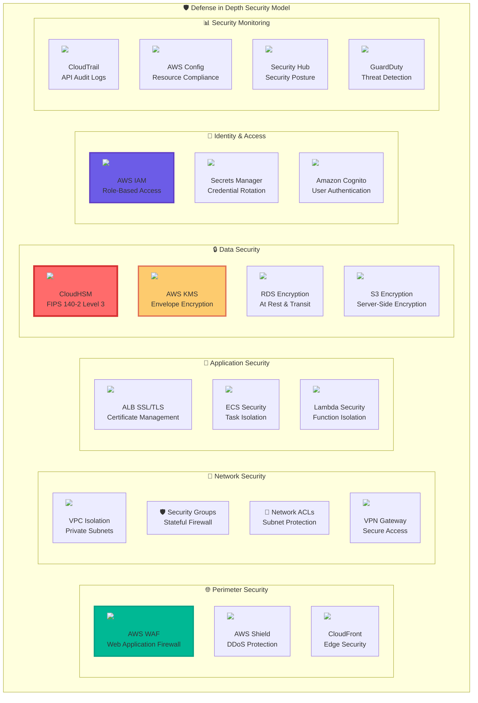
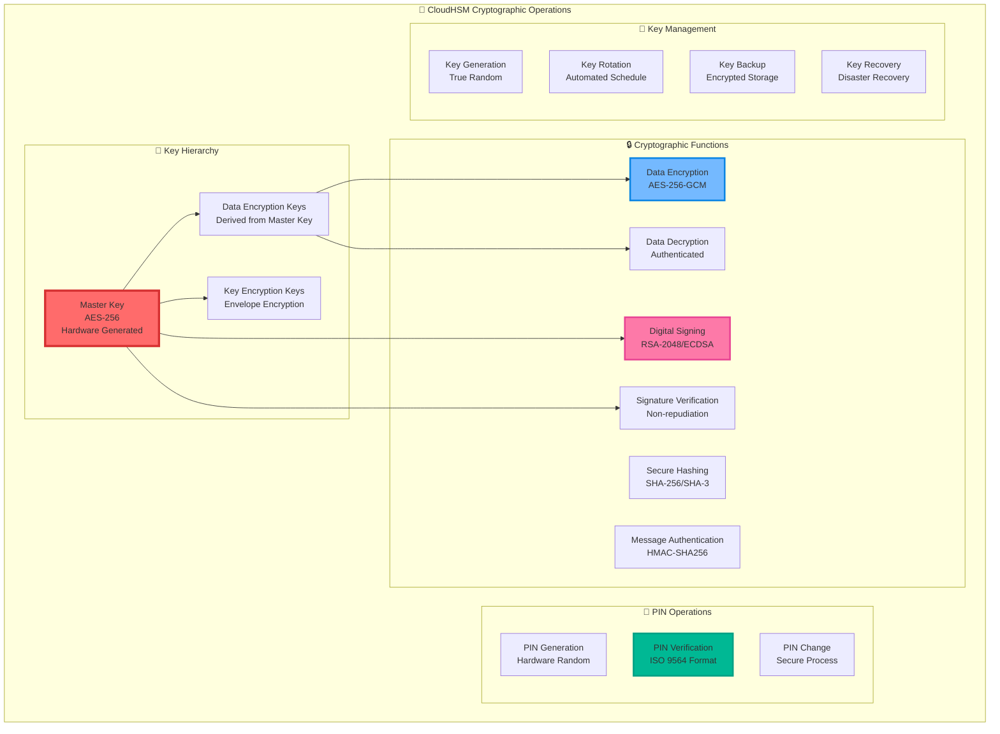
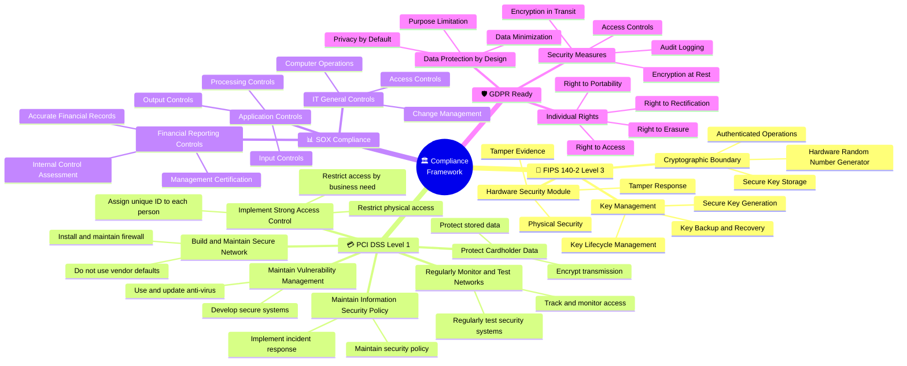
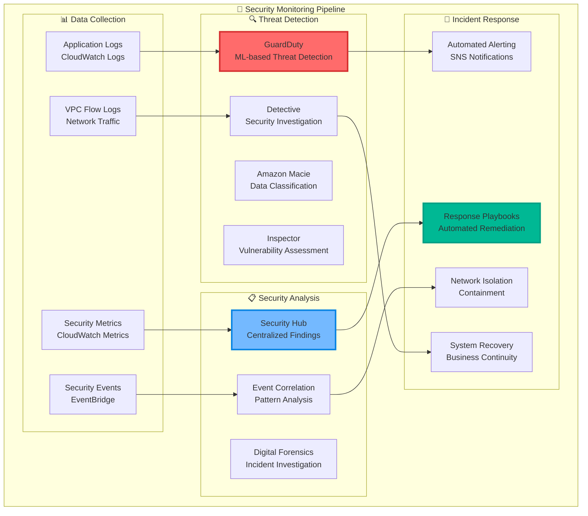
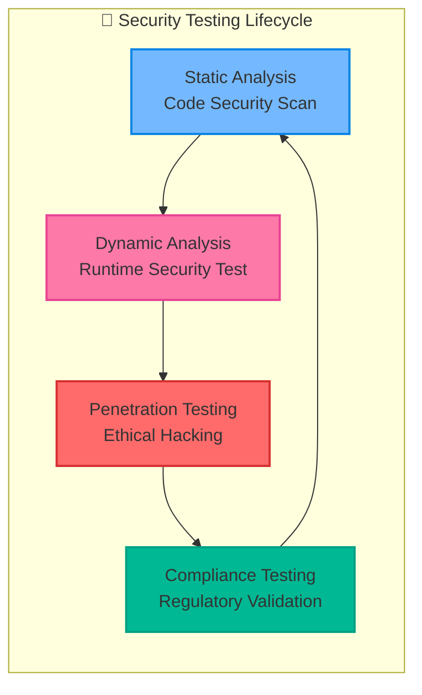

# Security Architecture

## Overview

This document details the comprehensive security architecture implemented in the CloudHSM Financial Transaction Processing Demo, showcasing enterprise-grade security controls and compliance frameworks.

## Security Layers

## Cryptographic Architecture

## Compliance Framework

## Security Controls Matrix

| Control Category | Implementation | AWS Service | Compliance |
|------------------|----------------|-------------|------------|
| **Cryptographic Protection** | Hardware-based encryption | CloudHSM | FIPS 140-2 Level 3 |
| **Key Management** | Automated rotation & backup | CloudHSM + KMS | PCI DSS Req 3 |
| **Access Control** | Role-based permissions | IAM | SOX, GDPR |
| **Network Security** | Private subnets, Security Groups | VPC | PCI DSS Req 1 |
| **Data Protection** | Encryption at rest & transit | RDS, S3, ALB | GDPR Art 32 |
| **Audit Logging** | Comprehensive audit trails | CloudTrail, CloudWatch | SOX, PCI DSS Req 10 |
| **Vulnerability Management** | Automated scanning | Inspector, Config | PCI DSS Req 6 |
| **Incident Response** | Automated alerting | CloudWatch, SNS | PCI DSS Req 12 |
| **Physical Security** | AWS data center controls | AWS Infrastructure | FIPS 140-2 |
| **Business Continuity** | Multi-AZ deployment | Multiple AZs | SOX |

## Threat Model

```mermaid
graph TB
    subgraph "🎯 Threat Landscape"
        subgraph "🌐 External Threats"
            DDOS[DDoS Attacks<br/>Volumetric & Application Layer]
            INJECTION[SQL/Code Injection<br/>Application Vulnerabilities]
            MITM[Man-in-the-Middle<br/>Network Interception]
            BRUTE[Brute Force Attacks<br/>Credential Compromise]
        end
        
        subgraph "🏢 Internal Threats"
            INSIDER[Insider Threats<br/>Privileged Access Abuse]
            MISCFG[Misconfigurations<br/>Security Control Bypass]
            LATERAL[Lateral Movement<br/>Network Compromise]
            PRIV_ESC[Privilege Escalation<br/>Access Control Bypass]
        end
        
        subgraph "🔐 Cryptographic Threats"
            KEY_COMP[Key Compromise<br/>Cryptographic Key Exposure]
            WEAK_CRYPTO[Weak Cryptography<br/>Algorithm Vulnerabilities]
            SIDE_CHANNEL[Side-Channel Attacks<br/>Hardware Exploitation]
            QUANTUM[Quantum Computing<br/>Future Cryptographic Threats]
        end
    end
    
    subgraph "🛡️ Security Controls"
        subgraph "🌐 Perimeter Defense"
            WAF_CTRL[AWS WAF Rules<br/>Application Protection]
            SHIELD_CTRL[AWS Shield<br/>DDoS Mitigation]
            RATE_LIMIT[Rate Limiting<br/>API Protection]
        end
        
        subgraph "🔒 Access Controls"
            MFA[Multi-Factor Authentication<br/>Strong Authentication]
            RBAC[Role-Based Access Control<br/>Least Privilege]
            ZERO_TRUST[Zero Trust Architecture<br/>Never Trust, Always Verify]
        end
        
        subgraph "🔐 Cryptographic Controls"
            HSM_CTRL[CloudHSM Protection<br/>Hardware Security]
            KEY_ROTATION[Automated Key Rotation<br/>Cryptographic Agility]
            PERFECT_FORWARD[Perfect Forward Secrecy<br/>Session Protection]
        end
    end
    
    DDOS -.->|Mitigated by| SHIELD_CTRL
    INJECTION -.->|Blocked by| WAF_CTRL
    MITM -.->|Prevented by| PERFECT_FORWARD
    BRUTE -.->|Stopped by| MFA
    INSIDER -.->|Limited by| RBAC
    KEY_COMP -.->|Protected by| HSM_CTRL
    WEAK_CRYPTO -.->|Addressed by| KEY_ROTATION
    
    style HSM_CTRL fill:#ff6b6b,stroke:#d63031,stroke-width:4px
    style SHIELD_CTRL fill:#74b9ff,stroke:#0984e3,stroke-width:3px
    style ZERO_TRUST fill:#00b894,stroke:#00a085,stroke-width:3px
```

## Security Monitoring and Incident Response

## Security Best Practices Implementation

### 1. **Zero Trust Architecture**
- Never trust, always verify
- Continuous authentication and authorization
- Micro-segmentation of network resources
- Least privilege access principles

### 2. **Defense in Depth**
- Multiple layers of security controls
- Redundant security mechanisms
- Fail-safe security defaults
- Security control diversity

### 3. **Cryptographic Excellence**
- Hardware-based key generation
- Strong cryptographic algorithms
- Perfect forward secrecy
- Cryptographic agility

### 4. **Continuous Monitoring**
- Real-time security monitoring
- Automated threat detection
- Proactive vulnerability management
- Incident response automation

### 5. **Compliance Automation**
- Automated compliance checking
- Continuous audit trails
- Policy as code implementation
- Regulatory reporting automation

## Security Testing Strategy

This comprehensive security architecture ensures that the CloudHSM Financial Transaction Processing Demo meets the highest standards of security, compliance, and operational excellence while providing a robust foundation for secure financial transaction processing.
